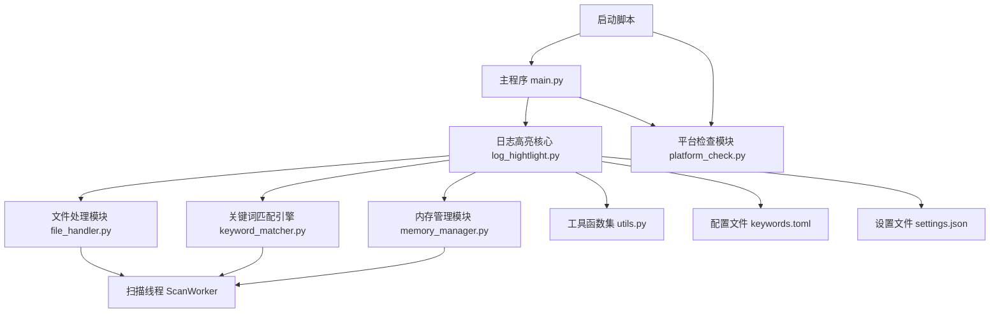
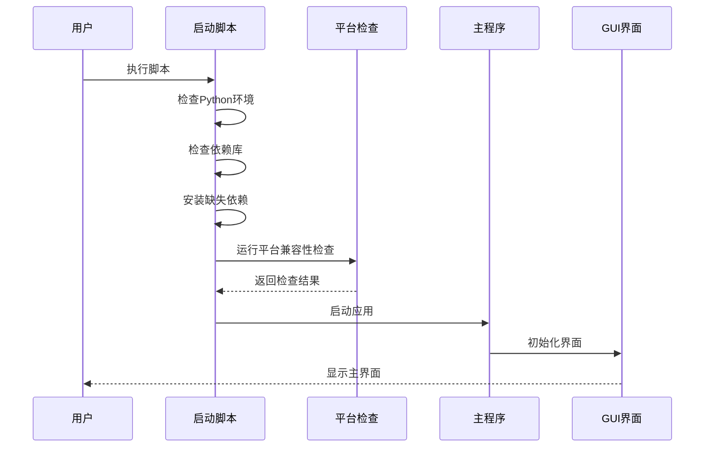
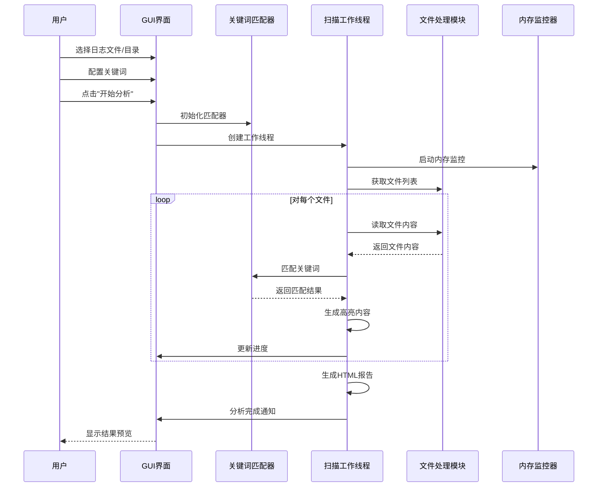
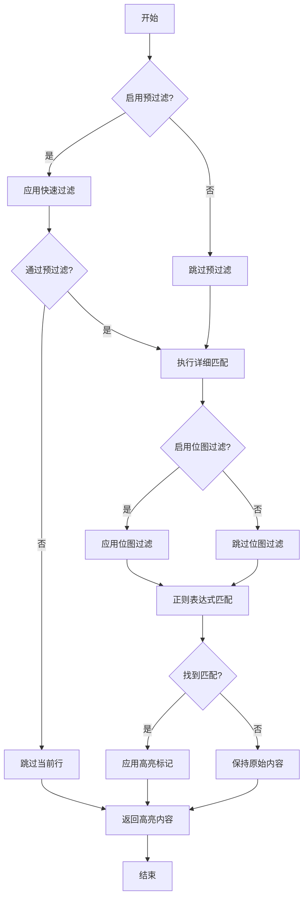
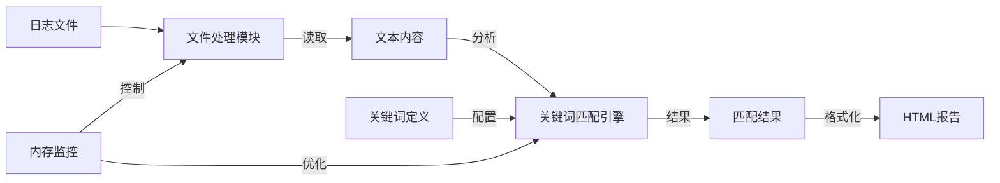

# 日志高亮工具 - 代码架构与流程图

本文档详细说明日志高亮工具的内部架构、模块关系和主要工作流程，帮助开发者更好地理解项目结构和代码逻辑。

## 项目架构

```
日志高亮工具
│
├── 核心组件
│   ├── 主程序 (log_hightlight.py / main.py)
│   │   ├── GUI界面管理
│   │   ├── 用户交互处理
│   │   └── 程序流程控制
│   │
│   ├── 关键词匹配引擎 (keyword_matcher.py)
│   │   ├── 正则表达式处理
│   │   ├── 位图过滤优化
│   │   └── 高亮处理
│   │
│   ├── 文件处理模块 (file_handler.py)
│   │   ├── 文件读写操作
│   │   ├── 压缩文件处理
│   │   └── 临时文件管理
│   │
│   ├── 内存管理模块 (memory_manager.py)
│   │   ├── 内存监控
│   │   ├── 资源优化
│   │   └── 性能分析
│   │
│   └── 工具函数集 (utils.py)
│       ├── 颜色管理
│       ├── 配置处理
│       └── 通用工具
│
├── 辅助组件
│   ├── 平台检查模块 (platform_check.py)
│   │   ├── 环境检测
│   │   ├── 依赖验证
│   │   └── 兼容性检查
│   │
│   └── 配置管理
│       ├── 程序设置 (settings.json)
│       └── 关键词定义 (keywords.toml)
│
└── 启动脚本
    ├── Windows启动脚本 (run_unified.bat)
    └── Linux/macOS启动脚本 (run_unified.sh)
```

## 模块关系图



## 主要流程图

### 应用启动流程



### 日志扫描流程



### 关键词匹配流程



## 核心组件功能

### 主程序 (log_hightlight.py / main.py)

日志高亮工具的主入口，负责：
- **界面管理**
  - 创建和维护PyQt5界面
  - 处理用户交互事件
  - 更新界面状态和进度
- **程序控制**
  - 协调各模块工作
  - 管理工作线程
  - 处理异常情况
- **配置管理**
  - 加载和保存设置
  - 处理配置文件
  - 维护用户偏好

### 关键词匹配引擎 (keyword_matcher.py)

负责文本内容中的关键词匹配和高亮处理：
- **匹配功能**
  - 支持普通文本匹配
  - 支持正则表达式匹配
  - 支持大小写敏感选项
  - 支持全词匹配选项
- **优化技术**
  - 使用位图过滤提高性能
  - 实现预过滤机制
  - 缓存正则表达式对象
- **高亮处理**
  - 应用HTML颜色标记
  - 处理重叠匹配
  - 保持原始格式

### 文件处理模块 (file_handler.py)

处理各种文件操作：
- **文件管理**
  - 创建和维护临时文件
  - 处理压缩文件解压
  - 管理文件句柄
- **读写优化**
  - 实现流式读取
  - 使用内存映射
  - 支持大文件分块
- **格式支持**
  - 文本文件处理
  - 压缩包处理
  - 编码处理

### 内存管理模块 (memory_manager.py)

监控和优化内存使用：
- **监控功能**
  - 跟踪内存使用
  - 检测内存压力
  - 生成使用报告
- **优化策略**
  - 动态调整缓存
  - 触发垃圾回收
  - 控制并行度
- **资源管理**
  - 释放未使用资源
  - 优化内存分配
  - 防止内存泄漏

### 工具函数集 (utils.py)

提供各种辅助功能：
- **颜色处理**
  - 生成配色方案
  - 转换颜色格式
  - 管理主题样式
- **配置工具**
  - 读写配置文件
  - 验证配置有效性
  - 提供默认值
- **通用功能**
  - 时间戳处理
  - 字符串操作
  - 路径处理

## 扫描线程详细流程

扫描工作线程是日志高亮工具的核心工作单元，其详细处理流程如下：

1. **初始化阶段**
   - 创建临时文件管理器
   - 初始化关键词匹配器
   - 设置进度监控器
   - 配置内存监控器

2. **扫描准备**
   - 确定扫描模式（自动、快速、精确、平衡）
   - 根据系统资源确定并行度
   - 按批次准备文件任务列表

3. **文件处理**
   - 检查文件大小，选择适当的读取策略：
     - 小文件：标准读取
     - 大文件：流式处理
     - 超大文件：内存映射(mmap)
   - 逐行读取文件内容
   - 对每行内容应用关键词匹配
   - 收集匹配结果

4. **结果处理**
   - 按时间范围分组结果
   - 生成HTML报告文件
   - 创建结果摘要和统计信息

5. **资源清理**
   - 关闭打开的文件
   - 清理临时文件
   - 释放系统资源

## 关键类和函数说明

### `LogHighlighter` 类

图形界面主类，提供用户交互界面和控制逻辑。主要方法：
- `init_ui()`: 初始化图形界面
- `analyze_combined_keywords()`: 启动关键词分析过程
- `add_directory()/add_file()/add_archive()`: 添加日志源
- `load_settings()/save_settings()`: 管理用户设置

### `ScanWorker` 类

处理扫描任务的工作线程。主要方法：
- `run()`: 线程主执行函数
- `scan_file()`: 扫描单个文件
- `_process_line_with_matcher()`: 处理单行内容
- `_generate_output_files()`: 生成结果文件

### `KeywordMatcher` 类

关键词匹配处理核心。主要方法：
- `match_line()`: 在文本行中匹配关键词
- `highlight_line()`: 对匹配内容应用高亮
- `should_process_line()`: 快速预过滤检查

### `TempFileManager` 类

管理临时文件。主要方法：
- `create_temp_file()`: 创建新的临时文件
- `cleanup_all()`: 清理所有临时文件

### `MemoryMonitor` 类

监控内存使用情况。主要方法：
- `_check_memory()`: 检查当前内存使用
- `suggest_worker_count()`: 根据内存建议工作线程数量

## 数据流图



## 性能优化策略

### 1. 内存优化
- 使用内存映射处理大文件
- 实现流式处理避免全文加载
- 动态调整缓存大小
- 及时释放不需要的资源

### 2. 速度优化
- 使用多线程并行处理
- 实现预过滤机制
- 使用位图过滤加速匹配
- 缓存编译后的正则表达式

### 3. 资源管理
- 动态调整线程数
- 智能分配工作负载
- 实现断点续扫
- 优化文件读写操作

## 错误处理机制

### 1. 异常捕获
- 文件操作异常
- 内存不足异常
- 正则表达式错误
- GUI相关异常

### 2. 恢复策略
- 保存检查点
- 清理临时文件
- 释放系统资源
- 重试失败操作

### 3. 用户反馈
- 显示错误信息
- 提供解决建议
- 记录详细日志
- 允许手动干预

## 扩展性设计

### 1. 模块化结构
- 清晰的模块边界
- 标准化接口
- 低耦合设计
- 可插拔组件

### 2. 配置系统
- 外部配置文件
- 运行时配置
- 用户偏好设置
- 主题定制

### 3. 插件机制
- 自定义关键词处理
- 新文件格式支持
- 结果输出格式
- 报告模板

## 模块详细说明

### 1. 主程序模块 (main.py)

主程序模块是整个应用的入口点，主要职责包括：

#### 1.1 GUI界面初始化
```python
class LogHighlighter(QMainWindow):
    def __init__(self):
        # 初始化主窗口
        self.init_ui()
        # 设置窗口属性
        self.setWindowTitle("日志关键词高亮工具")
        self.resize(1200, 800)
```

#### 1.2 用户交互处理
- 文件选择对话框
- 配置文件加载
- 按钮事件处理
- 进度条更新
- 状态栏消息

#### 1.3 工作流程控制
- 初始化扫描任务
- 创建工作线程
- 管理分析过程
- 处理结果展示

### 2. 日志高亮核心 (log_hightlight.py)

核心模块实现主要的业务逻辑：

#### 2.1 配置管理
```python
def load_config(self, config_path: str) -> Dict:
    """加载TOML配置文件"""
    with open(config_path, 'r', encoding='utf-8') as f:
        return toml.load(f)
```

#### 2.2 关键词组管理
- 关键词分组
- 颜色分配
- 匹配规则设置

#### 2.3 分析控制
- 任务分发
- 进度跟踪
- 结果收集
- 报告生成

### 3. 关键词匹配引擎 (keyword_matcher.py)

实现核心的文本匹配和处理逻辑：

#### 3.1 匹配器实现
```python
class KeywordMatcher:
    def __init__(self):
        self.patterns = {}
        self.colors = {}
        self.prefilter_enabled = True
        self.bitmap_filter_enabled = True
```

#### 3.2 匹配策略
- 普通文本匹配
  ```python
  def match_text(self, line: str, keyword: str, case_sensitive: bool) -> bool:
      if not case_sensitive:
          line = line.lower()
          keyword = keyword.lower()
      return keyword in line
  ```
- 正则表达式匹配
  ```python
  def match_regex(self, line: str, pattern: str) -> List[Match]:
      try:
          return list(re.finditer(pattern, line))
      except re.error:
          logging.error(f"正则表达式错误: {pattern}")
          return []
  ```
- 位图过滤优化
  ```python
  def apply_bitmap_filter(self, line: str) -> bool:
      # 使用位图快速过滤不可能匹配的行
      bitmap = self._create_bitmap(line)
      return any(self._check_bitmap(bitmap, kw) for kw in self.keywords)
  ```

#### 3.3 高亮处理
- HTML标记生成
- 颜色应用
- 重叠处理

### 4. 文件处理模块 (file_handler.py)

负责所有文件相关操作：

#### 4.1 文件读取策略
```python
class FileHandler:
    def read_file(self, path: str, size_threshold: int = 100*1024*1024):
        """根据文件大小选择读取策略"""
        size = os.path.getsize(path)
        if size < size_threshold:
            return self._read_small_file(path)
        else:
            return self._read_large_file(path)
```

#### 4.2 压缩文件处理
- RAR文件处理
  ```python
  def handle_rar(self, path: str) -> List[str]:
      with rarfile.RarFile(path) as rf:
          return self._extract_archive(rf)
  ```
- ZIP文件处理
- 7Z文件处理

#### 4.3 临时文件管理
```python
class TempFileManager:
    def __init__(self):
        self.temp_dir = os.path.join(tempfile.gettempdir(), "log_highlighter_temp")
        self.files = set()
        
    def cleanup(self):
        """清理所有临时文件"""
        for file in self.files:
            try:
                os.remove(file)
            except OSError:
                pass
```

### 5. 内存管理模块 (memory_manager.py)

负责内存监控和优化：

#### 5.1 内存监控
```python
class MemoryMonitor:
    def __init__(self, threshold_mb: int = 1000):
        self.threshold = threshold_mb * 1024 * 1024  # 转换为字节
        self.warning_level = 0.8  # 80%警告阈值
        
    def check_memory(self) -> Dict:
        """检查当前内存使用状况"""
        usage = psutil.Process().memory_info()
        return {
            'rss': usage.rss,  # 物理内存
            'vms': usage.vms,  # 虚拟内存
            'percent': usage.rss / self.threshold
        }
```

#### 5.2 资源优化
- 动态线程数调整
  ```python
  def suggest_thread_count(self) -> int:
      """根据当前内存使用情况建议线程数"""
      usage = self.check_memory()
      if usage['percent'] > self.warning_level:
          return max(1, self.current_threads - 1)
      return min(os.cpu_count(), self.max_threads)
  ```
- 缓存管理
- 垃圾回收控制

### 6. 工具函数集 (utils.py)

提供通用功能支持：

#### 6.1 颜色处理
```python
def generate_color(index: int) -> str:
    """生成互补色彩"""
    hue = (index * 137.508) % 360  # 黄金角度
    return f"hsl({hue}, 70%, 60%)"
```

#### 6.2 时间处理
```python
def parse_timestamp(line: str) -> Optional[datetime]:
    """解析多种格式的时间戳"""
    patterns = [
        r'\d{4}-\d{2}-\d{2} \d{2}:\d{2}:\d{2}',
        r'\d{4}/\d{2}/\d{2} \d{2}:\d{2}:\d{2}',
        # 更多模式...
    ]
    for pattern in patterns:
        if match := re.search(pattern, line):
            try:
                return datetime.strptime(match.group(), pattern)
            except ValueError:
                continue
    return None
```

#### 6.3 配置处理
```python
def load_settings(path: str) -> Dict:
    """加载并验证设置"""
    with open(path, 'r') as f:
        settings = json.load(f)
    return validate_settings(settings)
```

### 7. 平台检查模块 (platform_check.py)

负责环境兼容性检查：

#### 7.1 系统检查
```python
def check_system():
    """检查操作系统兼容性"""
    system = platform.system()
    if system == "Windows":
        return check_windows()
    elif system == "Darwin":
        return check_macos()
    elif system == "Linux":
        return check_linux()
```

#### 7.2 依赖检查
```python
def check_dependencies():
    """检查必要的Python包"""
    required = {
        'PyQt5': '5.15.0',
        'toml': '0.10.0',
        'psutil': '5.7.0'
    }
    for package, min_version in required.items():
        try:
            module = importlib.import_module(package)
            version = getattr(module, '__version__', '0.0.0')
            if parse_version(version) < parse_version(min_version):
                raise ImportError(f"{package} 版本过低")
        except ImportError as e:
            return False, str(e)
    return True, "所有依赖检查通过"
```

## 模块间通信

### 1. 信号机制
```python
class LogHighlighter(QMainWindow):
    scan_progress = pyqtSignal(str)  # 扫描进度信号
    scan_complete = pyqtSignal(str)  # 扫描完成信号
    scan_error = pyqtSignal(str)     # 错误信号
```

### 2. 回调机制
```python
class ScanWorker(QThread):
    def __init__(self, callback):
        super().__init__()
        self.callback = callback
        
    def run(self):
        try:
            result = self.process()
            self.callback(result)
        except Exception as e:
            self.error.emit(str(e))
```

### 3. 事件循环
```python
def main():
    app = QApplication(sys.argv)
    window = LogHighlighter()
    window.show()
    sys.exit(app.exec_())
``` 