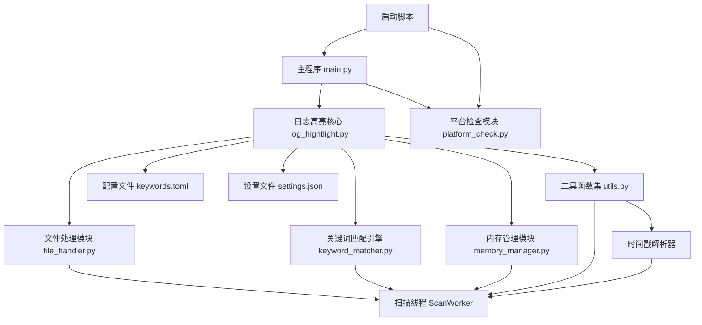
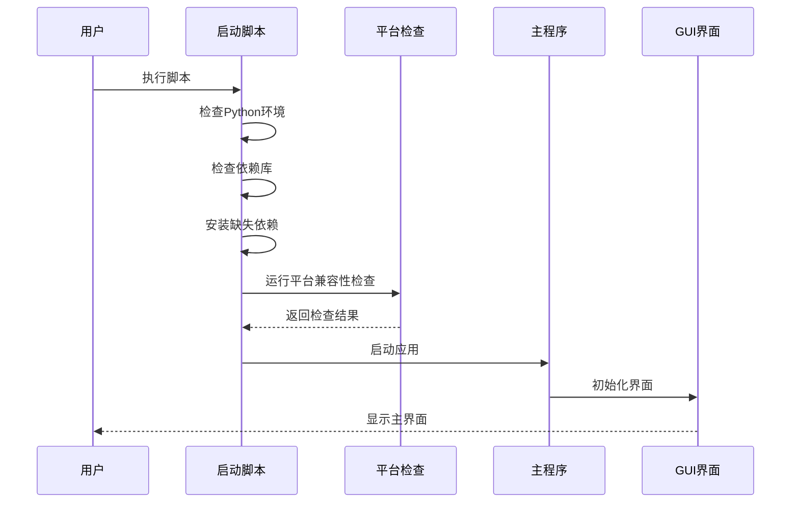
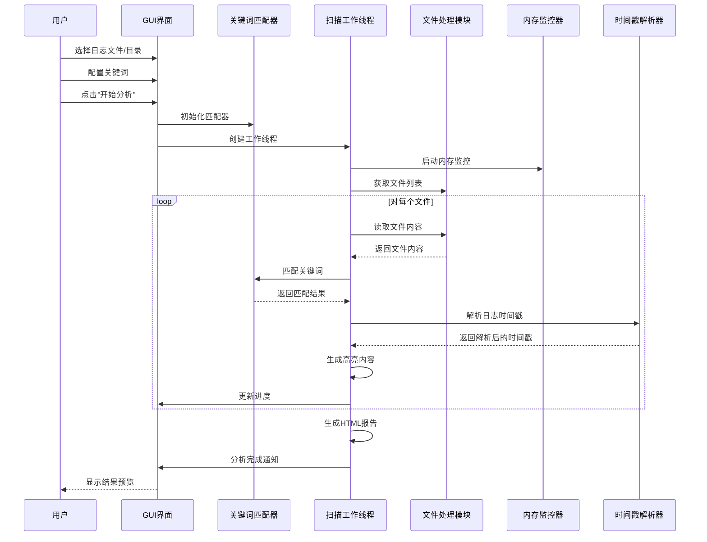
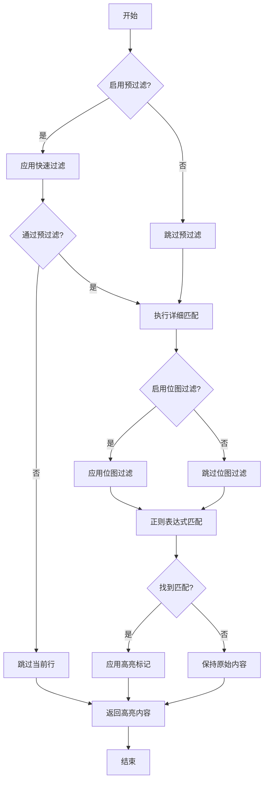
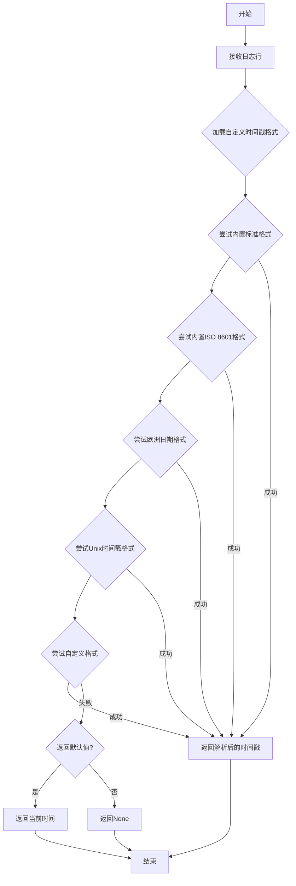

# 日志高亮工具 - 代码架构与流程图

本文档详细说明日志高亮工具的内部架构、模块关系和主要工作流程，帮助开发者更好地理解项目结构和代码逻辑。

## 项目架构

```
日志高亮工具
│
├── 核心组件
│   ├── 主程序 (log_hightlight.py / main.py)
│   │   ├── GUI界面管理
│   │   ├── 用户交互处理
│   │   └── 程序流程控制
│   │
│   ├── 关键词匹配引擎 (keyword_matcher.py)
│   │   ├── 正则表达式处理
│   │   ├── 位图过滤优化
│   │   └── 高亮处理
│   │
│   ├── 文件处理模块 (file_handler.py)
│   │   ├── 文件读写操作
│   │   ├── 压缩文件处理
│   │   └── 临时文件管理
│   │
│   ├── 内存管理模块 (memory_manager.py)
│   │   ├── 内存监控
│   │   ├── 资源优化
│   │   └── 性能分析
│   │
│   └── 工具函数集 (utils.py)
│       ├── 颜色管理
│       ├── 配置处理
│       ├── 时间戳解析
│       └── 通用工具
│
├── 辅助组件
│   ├── 平台检查模块 (platform_check.py)
│   │   ├── 环境检测
│   │   ├── 依赖验证
│   │   └── 兼容性检查
│   │
│   └── 配置管理
│       ├── 程序设置 (settings.json)
│       └── 关键词定义 (keywords.toml)
│
└── 启动脚本
    ├── Windows启动脚本 (run_unified.bat)
    └── Linux/macOS启动脚本 (run_unified.sh)
```

## 模块关系图



## 主要流程图

### 应用启动流程



### 日志扫描流程



### 关键词匹配流程



### 时间戳解析流程



## 核心组件功能

### 主程序 (log_hightlight.py / main.py)

日志高亮工具的主入口，负责：
- **界面管理**
  - 创建和维护PyQt5界面
  - 处理用户交互事件
  - 更新界面状态和进度
- **程序控制**
  - 协调各模块工作
  - 管理工作线程
  - 处理异常情况
- **配置管理**
  - 加载和保存设置
  - 处理配置文件
  - 维护用户偏好

### 关键词匹配引擎 (keyword_matcher.py)

负责文本内容中的关键词匹配和高亮处理：
- **匹配功能**
  - 支持普通文本匹配
  - 支持正则表达式匹配
  - 支持大小写敏感选项
  - 支持全词匹配选项
- **优化技术**
  - 使用位图过滤提高性能
  - 实现预过滤机制
  - 缓存正则表达式对象
- **高亮处理**
  - 应用HTML颜色标记
  - 处理重叠匹配
  - 保持原始格式

### 文件处理模块 (file_handler.py)

处理各种文件操作：
- **文件管理**
  - 创建和维护临时文件
  - 处理压缩文件解压
  - 管理文件句柄
- **读写优化**
  - 实现流式读取
  - 使用内存映射
  - 支持大文件分块
- **格式支持**
  - 文本文件处理
  - 压缩包处理
  - 编码处理

### 内存管理模块 (memory_manager.py)

监控和优化内存使用：
- **监控功能**
  - 跟踪内存使用
  - 检测内存压力
  - 生成使用报告
- **优化策略**
  - 动态调整缓存
  - 触发垃圾回收
  - 控制并行度
- **资源管理**
  - 释放未使用资源
  - 优化内存分配
  - 防止内存泄漏

### 工具函数集 (utils.py)

提供各种辅助功能：
- **颜色处理**
  - 生成配色方案
  - 转换颜色格式
  - 管理主题样式
- **配置工具**
  - 读写配置文件
  - 验证配置有效性
  - 提供默认值
- **时间戳解析**
  - 支持多种时间戳格式
  - 处理特殊时区格式
  - 提供自定义格式扩展
- **通用功能**
  - 字符串操作
  - 路径处理
  - HTML生成

## 扫描线程详细流程

扫描工作线程是日志高亮工具的核心工作单元，其详细处理流程如下：

1. **初始化阶段**
   - 创建临时文件管理器
   - 初始化关键词匹配器
   - 设置进度监控器
   - 配置内存监控器
   - 加载自定义时间戳格式

2. **扫描准备**
   - 确定扫描模式（自动、快速、精确、平衡）
   - 根据系统资源确定并行度
   - 按批次准备文件任务列表
   - 初始化结果存储结构

3. **文件处理**
   - 根据文件大小选择处理策略
   - 小文件：一次性读取到内存
   - 大文件：流式处理
   - 超大文件：内存映射处理
   - 处理不同编码

4. **行处理**
   - 应用关键词匹配
   - 解析时间戳
   - 生成高亮HTML
   - 按时间范围分组

5. **结果生成**
   - 按时间范围创建HTML文件
   - 排序匹配结果
   - 生成摘要报告
   - 创建索引页面

6. **结束清理**
   - 清理临时文件
   - 释放内存资源
   - 保存检查点信息
   - 发送完成信号

## 时间戳处理功能

日志高亮工具提供强大的时间戳解析功能，支持多种格式的时间戳识别和处理：

### 支持的时间戳格式

1. **标准日期时间格式**
   - YYYY-MM-DD HH:MM:SS.sss
   - YYYY-MM-DD HH:MM:SS
   - YYYY/MM/DD HH:MM:SS

2. **欧洲日期格式**
   - DD-MM-YYYY HH:MM:SS
   - DD/MM/YYYY HH:MM:SS
   - DD.MM.YYYY HH:MM:SS

3. **部分日期时间格式**
   - MM-DD HH:MM:SS.sss
   - MM-DD HH:MM:SS
   - HH:MM:SS.sss
   - HH:MM:SS

4. **ISO 8601格式**
   - YYYY-MM-DDThh:mm:ss.sssZ
   - YYYY-MM-DDThh:mm:ssZ
   - YYYY-MM-DDThh:mm:ss.sss+0000
   - YYYY-MM-DDThh:mm:ss+0000

5. **Unix时间戳**
   - 10位秒级时间戳
   - 13位毫秒级时间戳

6. **其他日志格式**
   - Apache日志格式: [DD/Mon/YYYY:HH:MM:SS +0000]
   - 自定义格式（通过settings.json配置）

### 时间戳解析流程

1. **预处理**
   - 验证输入行长度是否足够
   - 加载自定义时间戳格式

2. **格式尝试**
   - 按优先级尝试匹配各种格式
   - 使用正则表达式提取时间戳部分
   - 尝试使用datetime.strptime解析

3. **特殊处理**
   - Unix时间戳特殊转换
   - 处理不包含年份的时间戳
   - 处理只有时间没有日期的情况
   - 处理各种时区表示

4. **错误处理**
   - 解析失败时的优雅降级
   - 提供安全解析函数（parse_timestamp_safe）
   - 可选使用默认时间替代

### 自定义时间戳配置

通过settings.json文件，用户可以配置自己的时间戳格式：

```json
{
  "custom_timestamp_formats": [
    {
      "pattern": "\\[(\\d{2}/[A-Za-z]{3}/\\d{4}:\\d{2}:\\d{2}:\\d{2})\\]",
      "format": "%d/%b/%Y:%H:%M:%S"
    }
  ]
}
```

## 内存优化策略

日志高亮工具针对大规模日志文件处理进行了多项内存优化：

1. **分级处理策略**
   - 小文件（<100MB）：整体加载
   - 大文件（100MB-500MB）：流式处理
   - 超大文件（>500MB）：内存映射

2. **动态内存监控**
   - 实时监控内存使用率
   - 设置警告阈值（默认75%）
   - 设置危险阈值（默认90%）

3. **自适应并行度**
   - 根据内存压力动态调整线程数
   - 内存接近警告阈值时减少一半线程
   - 内存接近危险阈值时减少为1/4线程

4. **批处理与缓冲**
   - 分批处理文件列表
   - 结果缓冲区定期刷新
   - 启用垃圾回收周期

5. **预过滤优化**
   - 位图过滤快速排除无关行
   - 关键词预筛选减少正则匹配
   - 分级正则表达式处理

## 扩展与定制

日志高亮工具设计灵活，支持多种扩展和定制方式：

1. **关键词定义扩展**
   - 通过TOML配置文件添加关键词组
   - 支持正则表达式模式
   - 支持注释和颜色定制

2. **时间戳格式扩展**
   - 通过settings.json添加自定义时间戳格式
   - 支持复杂的正则表达式模式
   - 可指定详细的解析格式字符串

3. **用户界面定制**
   - 配置项可通过GUI调整
   - 设置持久化到配置文件
   - 关键词高亮颜色可自定义

4. **扫描策略定制**
   - 可选不同扫描模式
   - 可调整内存使用策略
   - 可配置并行处理参数

5. **输出格式定制**
   - HTML报告样式可定制
   - 时间范围分组参数可调整
   - 结果排序方式可配置

## 结论

日志高亮工具采用模块化设计，各组件职责清晰，通过优化的算法和内存管理策略，能够高效处理大规模日志文件。强大的时间戳解析功能使其能够适应各种日志格式，而灵活的扩展机制则让用户可以根据需要进行定制。 