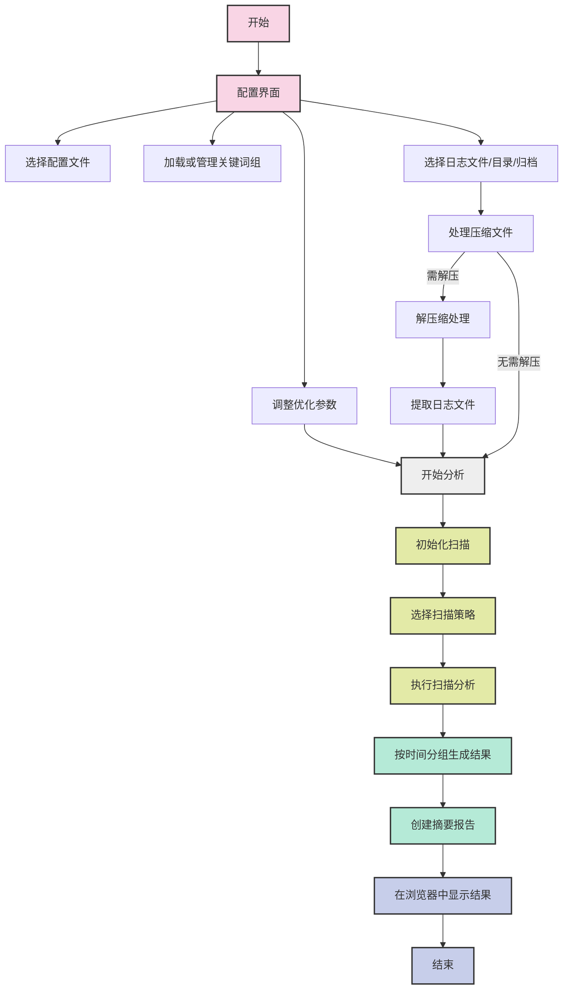
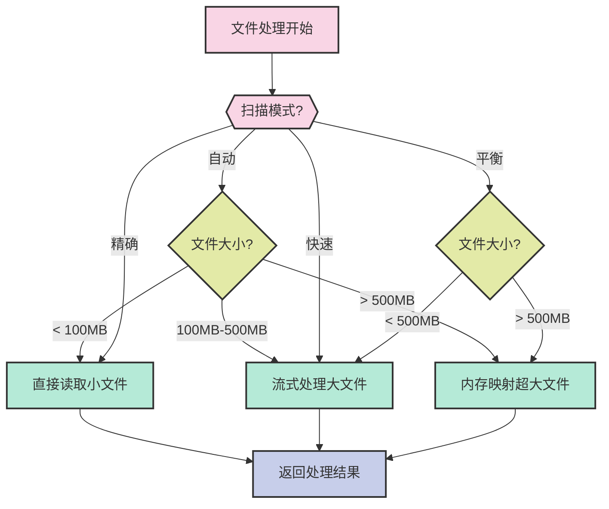
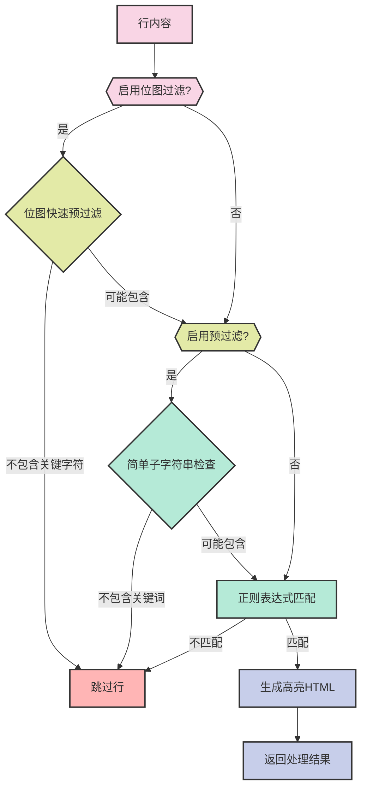
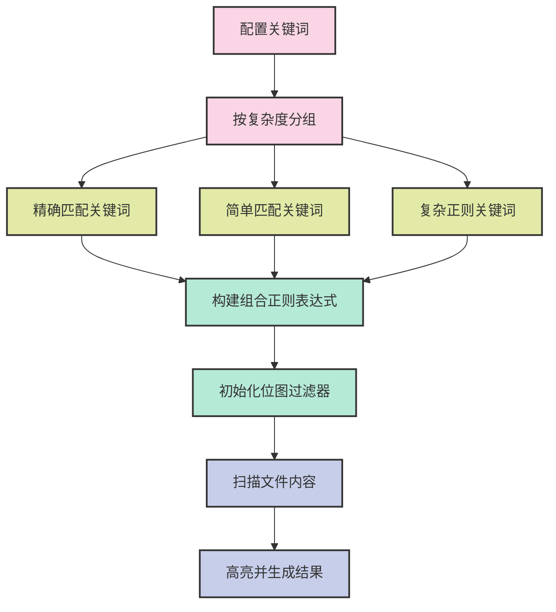

# 日志高亮分析工具流程图

## 1. 工具整体流程

```mermaid
graph TD
    A["开始"] --> B["配置界面"]
    B --> C["选择配置文件"]
    B --> D["加载或管理关键词组"]
    B --> E["选择日志文件/目录/归档"]
    B --> F1["调整优化参数"]
    E --> F2["处理压缩文件"]
    F2 -->|"需解压"| F3["解压缩处理"]
    F3 --> F4["提取日志文件"]
    F1 --> G["开始分析"]
    F4 --> G
    F2 -->|"无需解压"| G

    G --> H1["初始化扫描"]
    H1 --> H2["选择扫描策略"]
    H2 --> H3["执行扫描分析"]
    H3 --> I["按时间分组生成结果"]
    I --> J["创建摘要报告"]
    J --> K["在浏览器中显示结果"]
    K --> L["结束"]
    
    style A fill:#f9d5e5,stroke:#333,stroke-width:2px
    style B fill:#f9d5e5,stroke:#333,stroke-width:2px
    style G fill:#eeeeee,stroke:#333,stroke-width:2px
    style H1 fill:#e3eaa7,stroke:#333,stroke-width:2px
    style H2 fill:#e3eaa7,stroke:#333,stroke-width:2px
    style H3 fill:#e3eaa7,stroke:#333,stroke-width:2px
    style I fill:#b5ead7,stroke:#333,stroke-width:2px
    style J fill:#b5ead7,stroke:#333,stroke-width:2px
    style K fill:#c7ceea,stroke:#333,stroke-width:2px
    style L fill:#c7ceea,stroke:#333,stroke-width:2px
```

## 2. 文件处理策略选择

```mermaid
graph TD
    A["文件处理开始"] --> B{{"扫描模式?"}}
    B -->|"自动"| C{"文件大小?"}
    C -->|"< 100MB"| D["直接读取小文件"]
    C -->|"100MB-500MB"| E["流式处理大文件"]
    C -->|"> 500MB"| F["内存映射超大文件"]
    
    B -->|"快速"| E
    B -->|"精确"| D
    B -->|"平衡"| G{"文件大小?"}
    G -->|"< 500MB"| E
    G -->|"> 500MB"| F
    
    D --> Z["返回处理结果"]
    E --> Z
    F --> Z

    style A fill:#f9d5e5,stroke:#333,stroke-width:2px
    style B fill:#f9d5e5,stroke:#333,stroke-width:2px
    style C fill:#e3eaa7,stroke:#333,stroke-width:2px
    style D fill:#b5ead7,stroke:#333,stroke-width:2px
    style E fill:#b5ead7,stroke:#333,stroke-width:2px
    style F fill:#b5ead7,stroke:#333,stroke-width:2px
    style G fill:#e3eaa7,stroke:#333,stroke-width:2px
    style Z fill:#c7ceea,stroke:#333,stroke-width:2px
```

## 3. 多级优化的行处理流程

```mermaid
graph TD
    A["行内容"] --> B{{"启用位图过滤?"}}
    B -->|"是"| C{"位图快速预过滤"}
    B -->|"否"| D{{"启用预过滤?"}}
    
    C -->|"不包含关键字符"| Z1["跳过行"]
    C -->|"可能包含"| D
    
    D -->|"是"| E{"简单子字符串检查"}
    D -->|"否"| F["正则表达式匹配"]
    
    E -->|"不包含关键词"| Z1
    E -->|"可能包含"| F
    
    F -->|"不匹配"| Z1
    F -->|"匹配"| G["生成高亮HTML"]
    G --> Z2["返回处理结果"]
    
    style A fill:#f9d5e5,stroke:#333,stroke-width:2px
    style B fill:#f9d5e5,stroke:#333,stroke-width:2px
    style C fill:#e3eaa7,stroke:#333,stroke-width:2px
    style D fill:#e3eaa7,stroke:#333,stroke-width:2px
    style E fill:#b5ead7,stroke:#333,stroke-width:2px
    style F fill:#b5ead7,stroke:#333,stroke-width:2px
    style G fill:#c7ceea,stroke:#333,stroke-width:2px
    style Z1 fill:#ffb5b5,stroke:#333,stroke-width:2px
    style Z2 fill:#c7ceea,stroke:#333,stroke-width:2px
```

## 4. 关键词匹配优化流程

```mermaid
graph TD
    A["配置关键词"] --> B["按复杂度分组"]
    B --> C1["精确匹配关键词"]
    B --> C2["简单匹配关键词"]
    B --> C3["复杂正则关键词"]
    
    C1 --> D["构建组合正则表达式"]
    C2 --> D
    C3 --> D
    
    D --> E["初始化位图过滤器"]
    E --> F["扫描文件内容"]
    F --> G["高亮并生成结果"]
    
    style A fill:#f9d5e5,stroke:#333,stroke-width:2px
    style B fill:#f9d5e5,stroke:#333,stroke-width:2px
    style C1 fill:#e3eaa7,stroke:#333,stroke-width:2px
    style C2 fill:#e3eaa7,stroke:#333,stroke-width:2px
    style C3 fill:#e3eaa7,stroke:#333,stroke-width:2px
    style D fill:#b5ead7,stroke:#333,stroke-width:2px
    style E fill:#b5ead7,stroke:#333,stroke-width:2px
    style F fill:#c7ceea,stroke:#333,stroke-width:2px
    style G fill:#c7ceea,stroke:#333,stroke-width:2px
```

## 5. 工具优化点总览

```mermaid
graph TD
    A["日志高亮工具优化"] --> B1["内存优化"]
    A --> B2["性能优化"]
    A --> B3["UI界面优化"]
    A --> B4["功能增强"]
    
    B1 --> C1["分级文件处理策略"]
    B1 --> C2["内存映射超大文件"]
    B1 --> C3["流式处理大文件"]
    B1 --> C4["内存监控与自适应"]
    
    B2 --> D1["位图快速预过滤"]
    B2 --> D2["分级正则匹配"]
    B2 --> D3["优化线程池管理"]
    B2 --> D4["子字符串预检查"]
    
    B3 --> E1["扫描模式选择UI"]
    B3 --> E2["优化选项可视化"]
    B3 --> E3["进度详情显示"]
    B3 --> E4["内存占用实时反馈"]
    
    B4 --> F1["断点续传支持"]
    B4 --> F2["结果摘要报告"]
    B4 --> F3["多关键词精确匹配"]
    B4 --> F4["统计信息生成"]
    
    style A fill:#f9d5e5,stroke:#333,stroke-width:2px
    style B1 fill:#f9d5e5,stroke:#333,stroke-width:2px
    style B2 fill:#f9d5e5,stroke:#333,stroke-width:2px
    style B3 fill:#f9d5e5,stroke:#333,stroke-width:2px
    style B4 fill:#f9d5e5,stroke:#333,stroke-width:2px
    style C1 fill:#e3eaa7,stroke:#333,stroke-width:2px
    style C2 fill:#e3eaa7,stroke:#333,stroke-width:2px
    style C3 fill:#e3eaa7,stroke:#333,stroke-width:2px
    style C4 fill:#e3eaa7,stroke:#333,stroke-width:2px
    style D1 fill:#b5ead7,stroke:#333,stroke-width:2px
    style D2 fill:#b5ead7,stroke:#333,stroke-width:2px
    style D3 fill:#b5ead7,stroke:#333,stroke-width:2px
    style D4 fill:#b5ead7,stroke:#333,stroke-width:2px
    style E1 fill:#c7ceea,stroke:#333,stroke-width:2px
    style E2 fill:#c7ceea,stroke:#333,stroke-width:2px
    style E3 fill:#c7ceea,stroke:#333,stroke-width:2px
    style E4 fill:#c7ceea,stroke:#333,stroke-width:2px
    style F1 fill:#d3c0f9,stroke:#333,stroke-width:2px
    style F2 fill:#d3c0f9,stroke:#333,stroke-width:2px
    style F3 fill:#d3c0f9,stroke:#333,stroke-width:2px
    style F4 fill:#d3c0f9,stroke:#333,stroke-width:2px
``` 